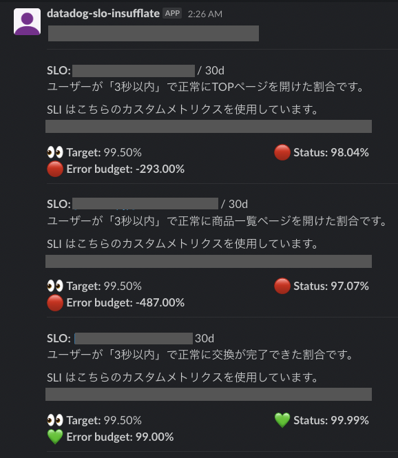

datadog-slo-insufflate
=======================

[](https://github.com/rluisr/datadog-slo-insufflate/actions/workflows/lint.yml)
[](https://github.com/rluisr/datadog-slo-insufflate/actions/workflows/release.yml)


```
MMMMMMMMMMMMMMMMMMMMMMMMMMMMMMMMMMMMMMMMMMMMMMMMMMMMMMMMMMMMMMMMMMMMMMMMMMMMMMMMMMMMMMMMMMMMMMMMMMM
MMMMMMMMMMMMMMMMMMMMMMMMMMMMMMMMMMMMMMMM8TWMMMMMMMMMMMMMMMMMMMMMMMMMMMMMMMMMMMMMMMMMMMMMMMMMMMMMMMM
MMMMMMMMMMMMMMMMMMMMMMMMMMMMMMMMMMMMMB6?zdWMMMMMMMMMMMMMMMMMMMMMMMMMMMMMMMMMMMMMMMMMMMMMMMMMMMMMMMM
MMMMMMMMMMMMMMMMMMMMMMMMMMMMMMMMMMM8zwIuXWMMMMMMMMMMMMMMMMMMMMMMMMMMMMMMMMMMMMMMMMMMMMMMMMMMMMMMMMM
MMMMMMMMMMMMMMMMMMMMMMMMMMMMMMMMM8wX0IwWXWMMMMMMMMMMMMMMMMMMMMMMMMMMMMMMMMMMMMMMMMMMMMMMMMMMMMMMMMM
MMMMMMMMMMMMMMMMMMMMMMMMMMMMMMMSwfW01dWfWMMMMMMMMMMMMMMMMMMMMMMMMMMMMMMMMMMMMMMMMMMMMMMMMMMMMMMMMMM
MMMMMMMMMMMMMMMMMMMMMMMMMMMMM8XVWWSOXWbfWMMMMMMMMMMMMMMMMMMMMMMMMMMMMMMMMMMMMMMMMMMMMMMMMMMMMMMMMMM
MMMMMMMMMMMMMMMMMMMMMMMMMMSwXWfW9OzwXHWHHWXkZXUVHMMMMMMMMMMMMMMMMMMMMMMMMMMMMMMMMMMMMMMMMMMMMMMMMMM
MMMMMMMMMMMMMMMMMMMMMMMB0wZXWfKwzz1wX@MMWZWyyZXXZXwOz1dMMMMMMMMMMMMMMMMMMMMMMMMMMMMMMMMMMMMMMMMMMMM
MMMMMMMMMMMMMMMMMMMMM8OOwXWWbWZWwOuXmHHXXXuXuXXU0XXZz1vHMMMMMMMMMMMMMMMMMMMMMMMMMMMMMMMMMMMMMMMMMMM
MMMMMMMMMMMMMMMMMMMC=zrvwXWWHkVXXwwWUUZzvzOvvwtzO1=zzwIz?MMMMMMMMMMMMMMMMMMMMMMMMMMMMMMMMMMMMMMMMMM
MMMMMMMMMMMMMMMMM3<<1OrXuXXWHHHHHkSlz=z<<+1lOwtwwXkAggmXz+TMMMMMMMMMMMMMMMMMMMMMMMMMMMMMMMMMMMMMMMM
MMMMMMMMMMMMMMMMC<~<+zzXXXXWHWWW9Izz?<??z<<1lOZwwOXWMNMHkwwAwXUuV7I1<<?igH9MNMMMMMMMMMMMMMMMMMMMMMM
MMMMMMMMMMMMMMN$<~~<1lOXyfpWWwOlz<++<+>=??><><<<<>+OOZUY1zXUXVZz<v1v><((zWMMNNMMMMMMMMMMMMMMMMMMMMM
MMMMMMMMMMMMMMNc_~:<?zOwwXWWC<<(;<<<1+?<;<~~~~_.-_(+OOOv1z+1z<<<<C?~<?(>+OWHM@MMMMMMMMMMMMMMMMMMMMM
MMMMMMMMMMMMMM9<<~:<1=lOwwX0>:(~:<<1?+<<~~_. _`....~?<<~_____` -_`.__(<jJdWHMIMMMMMMMMMMMMMMMMMMMMM
MMMMMMMMMMMMMMZz:(<;>1zrZVUI;<::<_<<+v+<__.`.`-__.  `````````` . _-(JAQgH9WHHGMMMMMMMMMMMMMMMMMMMMM
MMMMMMMMMMMMBOz<<:<;<<<<<<zz<;<:;;;+<(<___...-~__. ````````` ._++QWMNY!MN++-dMMMMSLOSLOSLOSLOSLOSLO
MMMMMMMMMMM8I<~__._~~~_~~_<<:;<;<+<+z=+<<(:___:__. ````` .((+dQNMMNMM] HHNNNMMSLOSLOSLOSLOSLOSLOSLO
MMMMMMMMMMSz<<~.~~_.~.~~~~~(;::;+>+z1<?<<;;<<;<~~(<..` _.(JXMMMMMMMNMNMNWMMSLOSLOSLOSLOSLOSLOSLOSLO
MMMMMMMMMUz<<~__.~~~.~.~~~:(:;<<;;<<__~:~_~~__..___~.._..~1XHMMMMMNMMMMNMMMMMMSLOSLOSLOSLOSLOSLOSLO
MMMMMMMMSz<~~..~...~~_:~~~(+<>><<<;:~_~___--~___.` ````` (zWHHHbHMMMMMM"MMMMMMMMMSLOSLOSLOSLOSLOSLO
MMMMMMMHC<:~~~~~~~~::(_(?<:+zlz==1<<_~__._.._.__. ``` ```-_(ZUfHkWHCNx:.7?MMMMMMMMMMMMMMMMMMMMMMMMM
MMMMMMBC<:_~~~~~~_~:;<?1+1+z+zOzzzz><~____._..____    ...~_(vXHHMMNWNkgHNmHMMMMMMMMMMMMMMMMMMMMMMMM
MMMMMM0z<~~~...__~<<<>>1zzOOzOwwwzzz<<~._~_._.-...._..__~<?1zyXWWWWHgHHMHMMBMMMMMMMMMMMMMMMMMMMMMMM
MMMMMRz<<:~.~.~~~_:;+11zlOzOzXrZXktzz1:__.._.-_ ___.-_~__(<+vZVXWHWHHWHHMHXMMMMMMMMMMMMMMMMMMMMMMMM
MMMMMVz;<~~._:~~__(<?11lzzwOwwXwXkXVO?<___.._.-___~_(;+++zzwXXkXpHHNHHM@HMMMMMMMMMMMMMMMMMMMMMMMMMM
MMMMHI;<<:~~~~~_(<>+11z+=OOtOlOwXXykwzc<(_~_-___((<++?zz11zwWNNMNNNMMMMMMMMMMMMMMMMMMMMMMMMMMMMMMMM
MMMMKv<::~__~_~:;><1zzOzzzzZ1ztrOXwUzwwz+<<____~:izzrwzdwQgNMMMMMMMMMMMMMMMMMMMMMMMMMMMMMMMMMMMMMMM
MMMM6<;<~~~~~~::<+?+?zzzOOz?1=OrOtlvz11<<<;;>>1zwwZXkkXqMMMMMMMMMMMMMMMMMMMMMMMMMMMMMMMMMMMMMMMMMMM
MMBI<<~:_~_~_(;:<+1v1+?z=+?1ztOvz1<<:<:<~~<<:;<1zOXWW0dMMMMMMMMMMMMMMMMMMMMMMMMMMMMMMMMMMMMMMMMMMMM
MMkv<_~~~~~:_~:;<;<>1zlzz1==zvzz<<<_~~~.~__.~_~(<?OXXHMMMMMMMMMMMMMMMMMMMMMMMMMMMMMMMMMMMMMMMMMMMMM
```

---

<p align="center">
  
</p>

---

Environment variables
----------------------

| Name                | Required | Default                       | Description                          |
|---------------------|----------|-------------------------------|--------------------------------------|
| SLACK_TOKEN         | yes      |                               |                                      |
| SLACK_CHANNEL_ID    | yes      |                               |                                      |
| SLACK_MESSAGE_TITLE |          | SLO daily reports :eyes:      |                                      |
| DD_API_KEY          | yes      |                               |                                      |
| DD_APP_KEY          | yes      |                               |                                      |
| DD_SLO_URL          |          | https://app.datadoghq.com/slo | Using for building a URL for the SLO |